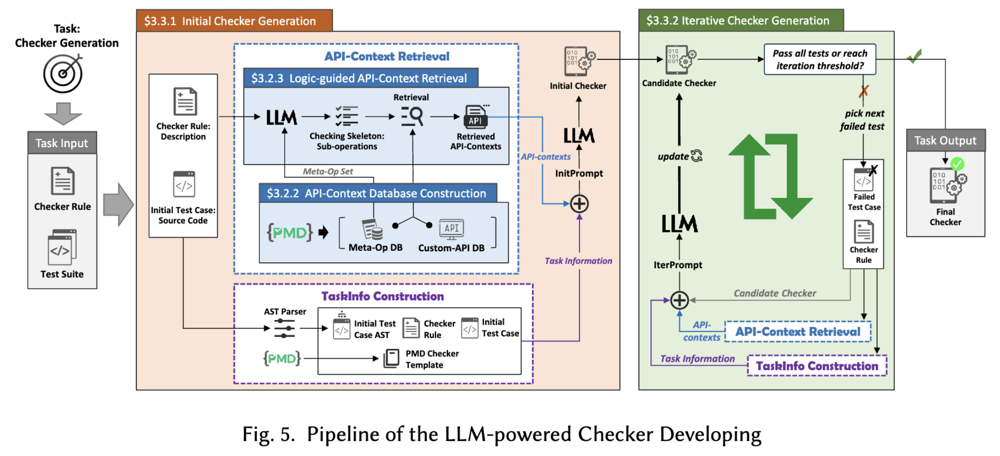

# AutoChecker

AutoChecker is a tool to automatically generate checker for static analyzers supported by LLM and based on textual description and test suite of the rule.

The paper is here: 

## Supported Static Analyzers

+ Java source code as target;
+ Scanning source code by traversing abstract syntax tree;
+ Representative analyzers: SonarQube, PMD......

## When to use AutoChecker?
If you are not familiar with the analyzer in which you want to customize checker.

## How to use AutoChecker?
### Preparation
Select a static analyzer.  
Collect Custom-API DB and implement Meta-op Set as Meta-op DB, you can know how to do in paper.  
Prepare Analyzer-Style AST Parser.
### Steps
1. Select a rule with test suite to generate initial checker.  
+ First, get the first countercase from test suite, parser it to AST;  
+ Second, input description and test case source code as parameters to call run_logic() in generator/AutoCheckerGenerator.py to get logics.  
+ Third, get the nodes on its AST, perform API-contexts retrieval with these nodes and logics by calling get_Most_Semantic_Similar_API_and_Snippet() in generator/AutoCheckerGenerator.py, and you can get testcase-related-API-contexts.  
+ Fourth, formatting checker_prompt as query to generate initial checker, you can call generate_checker_with_query() in generator/AutoCheckerGenerator.py.
2. Iterate the initial checker with test suite.
+ One test case corresponds to one round iteration.
+ See initial checker as the start candidate checker, see the first test-failed test case as input test case, after one iteration round, this new test case is integrated into a more robust new candidate checker. Repeat the iteration process until all test cases have been iterated.
+ This process almost reuse the initial checker generation query, the only difference is, candidate checker is also an input of the query.

The tool is available in directory "AutoChecker/generator/".

## Overview

### API-Context Retrieval

Each textual checking logic generated under test case first matches with Meta-Op DB, if it misses, then matches with Custom-API DB.  
The Meta_Op Set that is used to compose Meta-Op DB is in on the path "AutoChecker/Meta-op Set.xlsx".

### Iterative Checker Generation

## Experiment

### RQ1: Can AutoChecker effectively generate high-quality checker?

### RQ4: How does AutoChecker perform in practice?

Additionally added test cases for four rules are in directory "AutoChecker/practice/"

