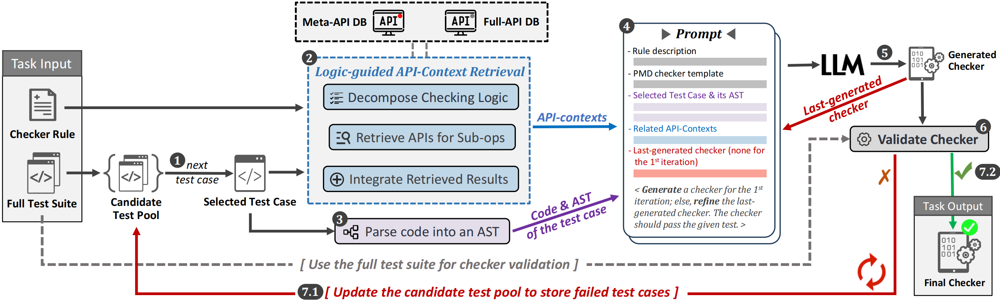

# AutoChecker

AutoChecker is a tool to automatically generate checker for static analyzers supported by LLM with textual description and test suite inputted.

**Overview**:

***Logic-guided API-Context Retrieval*** in overview:

## Tool Playground

We provide a tool demonstration website at https://autochecker.maskeduser.party.

## Repository Contents

### Directory  `tool`  -- Tool Implementation
+ `Classified_128rules.md` lists PMD's built-in all 128 rules.
+ `Meta-op Set.xlsx`: The Meta-Op Set that only contains meta-operation natural language description.
+ `PMD_MetaAPI_DB.json`: Content of MetaAPI DB.
+ `PMD_FullAPI_DB.json`: Content of FullAPI DB.
+ `PMD-Style-ASTParser.jar`: The PMD-Style AST parser which is used to parse source code to its AST.
+ `generator`: The source code of AutoChecker.

### Directory `experiment` -- Experimental Results
+ (Setup) experimental rules: `Experimental_20rules.json`.
+ (Setup) rules-related test case set: `experimental-20rules-test-suite`.
+ (RQ1) `baselines`: Results of baselines experiment.
+ (RQ1) `autochecker`: Results of AutoChecker evaluation experiment.
+ (RQ2) `ablation`: Results of ablation experiment.
+ (RQ4) `practice`: Detailed data about RQ4. 
  + Files ended with ".xml": Additionally added test cases in practice.
  + Files ended with ".txt": The augmented checker after iterating those added test cases.

## Detailed experimental results statistics(the best data marked in purple are taken in our paper)

<table>
  <tr>
    <th>Approach</th>
    <th>LLM</th>
    <th>#Rulepc</th>
    <th>#Rulepot</th>
    <th>#Rulepat</th>
    <th>#TCpass</th>
    <th>TPRavg</th>
  </tr>
  <tr>
    <td rowspan="12">NoCaseLLM</td>
    <td rowspan="3">Llama3.1</td>
    <td>0</td>
    <td>0</td>
    <td>0</td>
    <td>0</td>
    <td>0</td>
  </tr>
  <tr>
    <td>0</td>
    <td>0</td>
    <td>0</td>
    <td>0</td>
    <td>0</td>
  </tr>
  <tr>
    <td>0</td>
    <td>0</td>
    <td>0</td>
    <td>0</td>
    <td>0</td>
  </tr>
  <tr>
    <td rowspan="3">Qwen2.5-Coder</td>
    <td>5</td>
    <td>5</td>
    <td>1</td>
    <td>30</td>
    <td>17.82</td>
  </tr>
  <tr>
    <td>4</td>
    <td>3</td>
    <td>1</td>
    <td>30</td>
    <td>11.87</td>
  </tr>
  <tr>
    <td><b>5</b></td>
    <td><b>5</b></td>
    <td><b>1</b></td>
    <td><b>40</b></td>
    <td><b>19.41</b></td>
  </tr>
<tr>
    <td rowspan="3">GPT-4</td>
    <td>4</td>
    <td>4</td>
    <td>0</td>
    <td>36</td>
    <td>15.57</td>
  </tr>
  <tr>
    <td>4</td>
    <td>4</td>
    <td>1</td>
    <td>37</td>
    <td>13.89</td>
  </tr>
  <tr>
    <td><b>7</b></td>
    <td><b>7</b></td>
    <td><b>1</b></td>
    <td><b>62</b></td>
    <td><b>27.92</b></td>
  </tr>
<tr>
    <td rowspan="3">DeepSeek-V3</td>
    <td>7</td>
    <td>7</td>
    <td>1</td>
    <td>42</td>
    <td>24.38</td>
  </tr>
  <tr>
    <td><b>8</b></td>
    <td><b>8</b></td>
    <td><b>1</b></td>
    <td><b>56</b></td>
    <td><b>28.06</b></td>
  </tr>
  <tr>
    <td>7</td>
    <td>7</td>
    <td>1</td>
    <td>54</td>
    <td>22.79</td>
  </tr>
  <tr>
    <td rowspan="12">AllCasesLLM</td>
    <td rowspan="3">Llama3.1</td>
    <td>0</td>
    <td>0</td>
    <td>0</td>
    <td>0</td>
    <td>0</td>
  </tr>
  <tr>
    <td>0</td>
    <td>0</td>
    <td>0</td>
    <td>0</td>
    <td>0</td>
  </tr>
  <tr>
    <td>0</td>
    <td>0</td>
    <td>0</td>
    <td>0</td>
    <td>0</td>
  </tr>
  <tr>
    <td rowspan="3">Qwen2.5-Coder</td>
    <td>3</td>
    <td>3</td>
    <td>1</td>
    <td>14</td>
    <td>13.04</td>
  </tr>
  <tr>
    <td><b>4</b></td>
    <td><b>4</b></td>
    <td><b>1</b></td>
    <td><b>17</b></td>
    <td><b>14.40</b></td>
  </tr>
  <tr>
    <td>3</td>
    <td>3</td>
    <td>1</td>
    <td>14</td>
    <td>13.04</td>
  </tr>
<tr>
    <td rowspan="3">GPT-4</td>
    <td>5</td>
    <td>5</td>
    <td>1</td>
    <td>38</td>
    <td>15.84</td>
  </tr>
  <tr>
    <td><b>5</b></td>
    <td><b>5</b></td>
    <td><b>2</b></td>
    <td><b>36</b></td>
    <td><b>21.53</b></td>
  </tr>
  <tr>
    <td>6</td>
    <td>5</td>
    <td>2</td>
    <td>52</td>
    <td>19.40</td>
  </tr>
<tr>
    <td rowspan="3">DeepSeek-V3</td>
    <td><b>6</b></td>
    <td><b>6</b></td>
    <td><b>2</b></td>
    <td><b>43</b></td>
    <td><b>24.60</b></td>
  </tr>
  <tr>
    <td>6</td>
    <td>6</td>
    <td>2</td>
    <td>50</td>
    <td>23.26</td>
  </tr>
  <tr>
    <td>5</td>
    <td>4</td>
    <td>2</td>
    <td>18</td>
    <td>15.89</td>
  </tr>
  <tr>
    <td rowspan="12">NoCaseLLMR</td>
    <td rowspan="3">Llama3.1</td>
    <td>1</td>
    <td>1</td>
    <td>0</td>
    <td>1</td>
    <td>2.50</td>
  </tr>
  <tr>
    <td>0</td>
    <td>0</td>
    <td>0</td>
    <td>0</td>
    <td>0</td>
  </tr>
  <tr>
    <td><b>2</b></td>
    <td><b>2</b></td>
    <td><b>0</b></td>
    <td><b>16</b></td>
    <td><b>4.71</b></td>
  </tr>
  <tr>
    <td rowspan="3">Qwen2.5-Coder</td>
    <td>7</td>
    <td>7</td>
    <td>0</td>
    <td>43</td>
    <td>22.90</td>
  </tr>
  <tr>
    <td>8</td>
    <td>8</td>
    <td>1</td>
    <td>53</td>
    <td>27.76</td>
  </tr>
  <tr>
    <td><b>9</b></td>
    <td><b>9</b></td>
    <td><b>2</b></td>
    <td><b>60</b></td>
    <td><b>30.68</b></td>
  </tr>
<tr>
    <td rowspan="3">GPT-4</td>
    <td><b>10</b></td>
    <td><b>10</b></td>
    <td><b>1</b></td>
    <td><b>108</b></td>
    <td><b>30.82</b></td>
  </tr>
  <tr>
    <td>9</td>
    <td>9</td>
    <td>1</td>
    <td>92</td>
    <td>25.95</td>
  </tr>
  <tr>
    <td>6</td>
    <td>6</td>
    <td>1</td>
    <td>38</td>
    <td>22.73</td>
  </tr>
<tr>
    <td rowspan="3">DeepSeek-V3</td>
    <td><b>9</b></td>
    <td><b>9</b></td>
    <td><b>2</b></td>
    <td><b>92</b></td>
    <td><b>32.05</b></td>
  </tr>
  <tr>
    <td>10</td>
    <td>9</td>
    <td>1</td>
    <td>94</td>
    <td>27.84</td>
  </tr>
  <tr>
    <td>10</td>
    <td>10</td>
    <td>1</td>
    <td>58</td>
    <td>27.60</td>
  </tr>
  <tr>
    <td rowspan="12">NoCaseLLMC</td>
    <td rowspan="3">Llama3.1</td>
    <td>0</td>
    <td>0</td>
    <td>0</td>
    <td>0</td>
    <td>0</td>
  </tr>
  <tr>
    <td>0</td>
    <td>0</td>
    <td>0</td>
    <td>0</td>
    <td>0</td>
  </tr>
  <tr>
    <td>0</td>
    <td>0</td>
    <td>0</td>
    <td>0</td>
    <td>0</td>
  </tr>
  <tr>
    <td rowspan="3">Qwen2.5-Coder</td>
    <td>5</td>
    <td>5</td>
    <td>1</td>
    <td>26</td>
    <td>15.74</td>
  </tr>
  <tr>
    <td><b>6</b></td>
    <td><b>6</b></td>
    <td><b>1</b></td>
    <td><b>45</b></td>
    <td><b>21.18</b></td>
  </tr>
  <tr>
    <td>5</td>
    <td>5</td>
    <td>1</td>
    <td>30</td>
    <td>18.60</td>
  </tr>
<tr>
    <td rowspan="3">GPT-4</td>
    <td>7</td>
    <td>7</td>
    <td>0</td>
    <td>42</td>
    <td>22.19</td>
  </tr>
  <tr>
    <td><b>8</b></td>
    <td><b>8</b></td>
    <td><b>1</b></td>
    <td><b>94</b></td>
    <td><b>27.26</b></td>
  </tr>
  <tr>
    <td>8</td>
    <td>8</td>
    <td>1</td>
    <td>59</td>
    <td>22.86</td>
  </tr>
<tr>
    <td rowspan="3">DeepSeek-V3</td>
    <td><b>9</b></td>
    <td><b>9</b></td>
    <td><b>0</b></td>
    <td><b>66</b></td>
    <td><b>29.40</b></td>
  </tr>
  <tr>
    <td>8</td>
    <td>8</td>
    <td>1</td>
    <td>52</td>
    <td>28.71</td>
  </tr>
  <tr>
    <td>9</td>
    <td>9</td>
    <td>1</td>
    <td>105</td>
    <td>27.97</td>
  </tr>
  <tr>
    <td rowspan="12">NoCaseLLMRC</td>
    <td rowspan="3">Llama3.1</td>
    <td>0</td>
    <td>0</td>
    <td>0</td>
    <td>0</td>
    <td>0</td>
  </tr>
  <tr>
    <td><b>2</b></td>
    <td><b>2</b></td>
    <td><b>0</b></td>
    <td><b>7</b></td>
    <td><b>6.25</b></td>
  </tr>
  <tr>
    <td>2</td>
    <td>2</td>
    <td>0</td>
    <td>8</td>
    <td>4.94</td>
  </tr>
  <tr>
    <td rowspan="3">Qwen2.5-Coder</td>
    <td><b>9</b></td>
    <td><b>9</b></td>
    <td><b>1</b></td>
    <td><b>60</b></td>
    <td><b>30.49</b></td>
  </tr>
  <tr>
    <td>8</td>
    <td>8</td>
    <td>1</td>
    <td>55</td>
    <td>27.09</td>
  </tr>
  <tr>
    <td>8</td>
    <td>7</td>
    <td>1</td>
    <td>41</td>
    <td>24.19</td>
  </tr>
<tr>
    <td rowspan="3">GPT-4</td>
    <td>8</td>
    <td>7</td>
    <td>1</td>
    <td>34</td>
    <td>22.87</td>
  </tr>
  <tr>
    <td><b>8</b></td>
    <td><b>8</b></td>
    <td><b>1</b></td>
    <td><b>105</b></td>
    <td><b>27.74</b></td>
  </tr>
  <tr>
    <td>8</td>
    <td>8</td>
    <td>0</td>
    <td>39</td>
    <td>22.50</td>
  </tr>
<tr>
    <td rowspan="3">DeepSeek-V3</td>
    <td><b>11</b></td>
    <td><b>11</b></td>
    <td><b>1</b></td>
    <td><b>101</b></td>
    <td><b>38.93</b></td>
  </tr>
  <tr>
    <td>11</td>
    <td>11</td>
    <td>1</td>
    <td>119</td>
    <td>33.83</td>
  </tr>
  <tr>
    <td>11</td>
    <td>11</td>
    <td>1</td>
    <td>108</td>
    <td>32.09</td>
  </tr>
  <tr>
    <td rowspan="12">AutoChecker</td>
    <td rowspan="3">Llama3.1</td>
    <td><b>3</b></td>
    <td><b>3</b></td>
    <td><b>1</b></td>
    <td><b>22</b></td>
    <td><b>8.41</b></td>
  </tr>
  <tr>
    <td>2</td>
    <td>2</td>
    <td>0</td>
    <td>17</td>
    <td>4.12</td>
  </tr>
  <tr>
    <td>1</td>
    <td>1</td>
    <td>0</td>
    <td>17</td>
    <td>4.47</td>
  </tr>
  <tr>
    <td rowspan="3">Qwen2.5-Coder</td>
    <td><b>20</b></td>
    <td><b>20</b></td>
    <td><b>4</b></td>
    <td><b>257</b></td>
    <td><b>79.01</b></td>
  </tr>
  <tr>
    <td>18</td>
    <td>18</td>
    <td>3</td>
    <td>226</td>
    <td>65.62</td>
  </tr>
  <tr>
    <td>18</td>
    <td>18</td>
    <td>2</td>
    <td>241</td>
    <td>68.90</td>
  </tr>
<tr>
    <td rowspan="3">GPT-4</td>
    <td><b>20</b></td>
    <td><b>20</b></td>
    <td><b>6</b></td>
    <td><b>278</b></td>
    <td><b>82.28</b></td>
  </tr>
  <tr>
    <td>17</td>
    <td>17</td>
    <td>6</td>
    <td>228</td>
    <td>66.63</td>
  </tr>
  <tr>
    <td>20</td>
    <td>20</td>
    <td>5</td>
    <td>261</td>
    <td>79.36</td>
  </tr>
<tr>
    <td rowspan="3">DeepSeek-V3</td>
    <td>18</td>
    <td>18</td>
    <td>5</td>
    <td>257</td>
    <td>76.59</td>
  </tr>
  <tr>
    <td><b>19</b></td>
    <td><b>19</b></td>
    <td><b>4</b></td>
    <td><b>278</b></td>
    <td><b>80.86</b></td>
  </tr>
  <tr>
    <td>19</td>
    <td>19</td>
    <td>5</td>
    <td>264</td>
    <td>75.86</td>
  </tr>
  <tr>
    <td rowspan="6">AutoCheckerWoR</td>
    <td rowspan="3">GPT-4</td>
    <td>18</td>
    <td>18</td>
    <td>2</td>
    <td>230</td>
    <td>61.88</td>
  </tr>
  <tr>
    <td>15</td>
    <td>15</td>
    <td>3</td>
    <td>225</td>
    <td>56.38</td>
  </tr>
  <tr>
    <td><b>18</b></td>
    <td><b>18</b></td>
    <td><b>2</b></td>
    <td><b>231</b></td>
    <td><b>67.27</b></td>
  </tr>
  <tr>
    <td rowspan="3">DeepSeek-V3</td>
    <td><b>15</b></td>
    <td><b>15</b></td>
    <td><b>2</b></td>
    <td><b>221</b></td>
    <td><b>59.17</b></td>
  </tr>
  <tr>
    <td>14</td>
    <td>14</td>
    <td>2</td>
    <td>229</td>
    <td>58.03</td>
  </tr>
  <tr>
    <td>14</td>
    <td>14</td>
    <td>2</td>
    <td>210</td>
    <td>55.83</td>
  </tr>
  <tr>
    <td rowspan="6">AutoCheckerWoI</td>
    <td rowspan="3">GPT-4</td>
    <td>6</td>
    <td>6</td>
    <td>2</td>
    <td>31</td>
    <td>24.16</td>
  </tr>
  <tr>
    <td><b>8</b></td>
    <td><b>8</b></td>
    <td><b>2</b></td>
    <td><b>65</b></td>
    <td><b>29.37</b></td>
  </tr>
  <tr>
    <td>5</td>
    <td>5</td>
    <td>2</td>
    <td>33</td>
    <td>19.24</td>
  </tr>
  <tr>
    <td rowspan="3">DeepSeek-V3</td>
    <td><b>14</b></td>
    <td><b>14</b></td>
    <td><b>4</b></td>
    <td><b>141</b></td>
    <td><b>53.44</b></td>
  </tr>
  <tr>
    <td>15</td>
    <td>15</td>
    <td>3</td>
    <td>162</td>
    <td>52.79</td>
  </tr>
  <tr>
    <td>13</td>
    <td>13</td>
    <td>3</td>
    <td>110</td>
    <td>42.96</td>
  </tr>
<tr>
    <td rowspan="6">AutoCheckerWoM</td>
    <td rowspan="3">GPT-4</td>
    <td><b>17</b></td>
    <td><b>17</b></td>
    <td><b>3</b></td>
    <td><b>256</b></td>
    <td><b>66.42</b></td>
  </tr>

<tr>
    <td>16</td>
    <td>16</td>
    <td>1</td>
    <td>189</td>
    <td>54.15</td>
  </tr>

<tr>
    <td>16</td>
    <td>16</td>
    <td>3</td>
    <td>239</td>
    <td>60.09</td>
  </tr>
  
  <tr>
    <td rowspan="3">DeepSeek-V3</td>
    <td><b>18</b></td>
    <td><b>18</b></td>
    <td><b>1</b></td>
    <td><b>258</b></td>
    <td><b>72.92</b></td>
  </tr>

<tr>
    <td>15</td>
    <td>15</td>
    <td>2</td>
    <td>215</td>
    <td>60.30</td>
  </tr>

<tr>
    <td>15</td>
    <td>15</td>
    <td>1</td>
    <td>209</td>
    <td>59.13</td>
  </tr>
  
</table>
